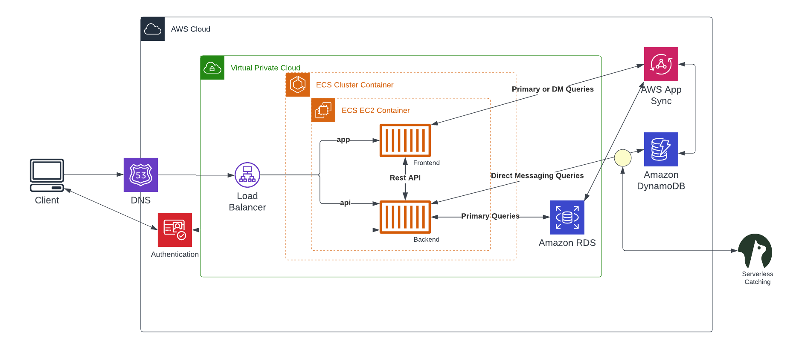
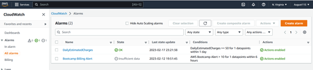
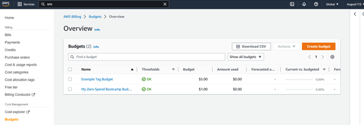

# Week 0 — Billing and Architecture

## Summary
This week served as a bootcamp overview and introduction to cloud spend. After a review of the project, business use-case and AWS services, we were left with guides for the following tasks: 
- [x] watch spend and security videoes
- [x] recreate the conceptual diagram
- [x] recreate the logical architectural diagram
- [x] create an admin user
- [x] use CloudShell
- [x] generate AWS credentials
- [x] install AWS CLI
- [x] create a billing alarn
- [x] create a budget

Below the work for some of the above tasks are shown as well as the creation of an IAM role and setting MFA.

### Conceptual Diagram
insert picture

### Logiccal Architectural Diagram (LINK)

### Installation of AWS CLI
This can be seen through the **(LINK)** file.

### Billing Alarms
The screenshot below shows two billing alarms. The *DailyEstimatedCharges* was set using and can be seen in the json file **(LINK)**.

### Budgets
The screenshot below shows two budgets alarms. The *My Zero-Spend Bootcamp Budget* was set using the console. The *Example Tag Budget* was set using and can be seen in the json file **(LINK)**.

  
  <strong> 
Additional
 </strong>
  
  ### IAM Role and MFA
  In addition to the above I set an IAM role with
 

