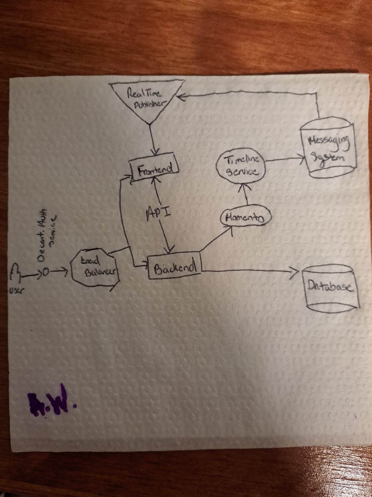
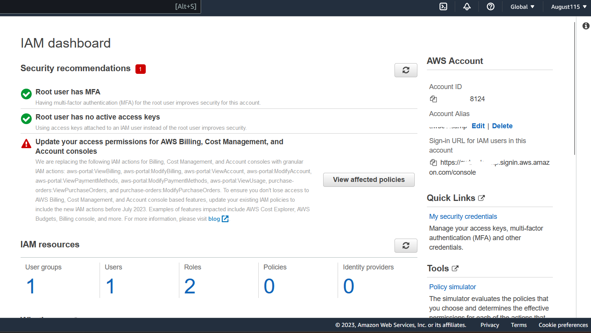

# Week 0 — Billing and Architecture

## Summary
This week served as a bootcamp overview and introduction to cloud spend. After a review of the project, business use-case and AWS services, we were left with guides for the following tasks: 
- [x] watch spend and security videoes
- [x] recreate the conceptual diagram
- [x] recreate the logical architectural diagram
- [x] create an admin user
- [x] use CloudShell
- [x] generate AWS credentials
- [x] install AWS CLI
- [x] create a billing alarn
- [x] create a budget

Below the work for some of the above tasks are shown as well as the creation of an IAM role and setting MFA.

### Conceptual Diagram

### [Logical Architectural Diagram](https://lucid.app/lucidchart/b2da19de-4219-479b-b164-423dee699c3b/edit?viewport_loc=-318%2C-278%2C2560%2C1130%2C0_0&invitationId=inv_6fb4c238-057a-44ed-8fc1-15d39b8bd421)

### Installation of AWS CLI
This can be seen through the [.gitpod.yml](https://github.com/August115/aws-bootcamp-cruddur-2023/blob/main/.gitpod.yml) file.

### Billing Alarms
The screenshot below shows two billing alarms. The *DailyEstimatedCharges* was set using a [json file](https://github.com/August115/aws-bootcamp-cruddur-2023/blob/main/aws/json/alarm-config.json).

### Budgets
The screenshot below shows two budgets alarms. The *My Zero-Spend Bootcamp Budget* was set using the console. The *Example Tag Budget* was set though the json files [budget.json](https://github.com/August115/aws-bootcamp-cruddur-2023/blob/main/aws/json/budget.json) and [budget-notifications-with-subscribers.json](https://github.com/August115/aws-bootcamp-cruddur-2023/blob/main/aws/json/budget-notifications-with-subscribers.json).

---

  
  <strong> 
Homework Challenge
 </strong>
  
  ### IAM Role and MFA
  In addition to the above I set an IAM role within my account.
  
  
 

